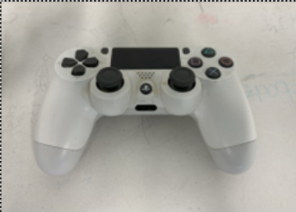
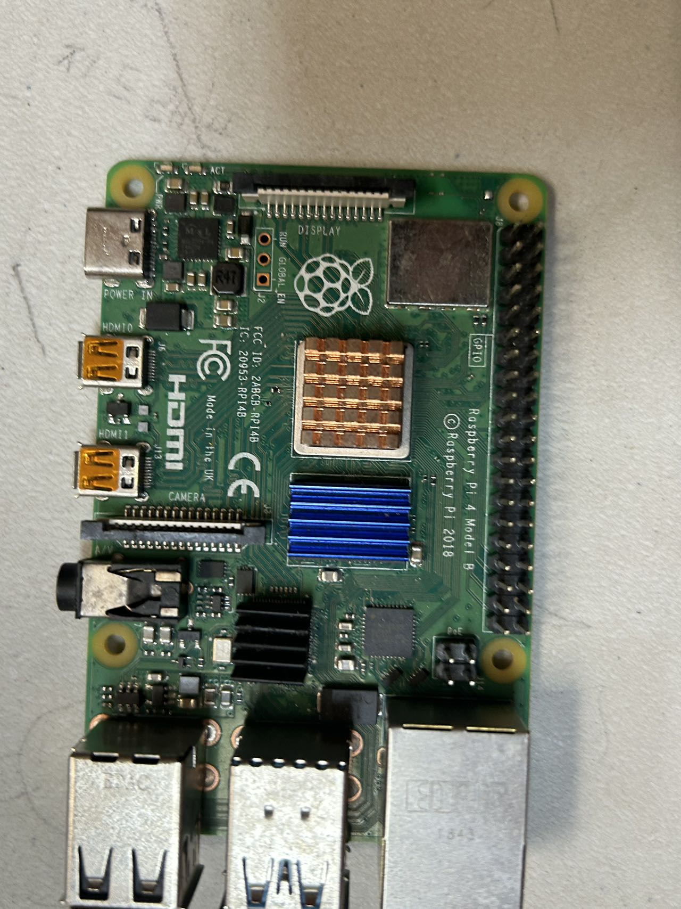
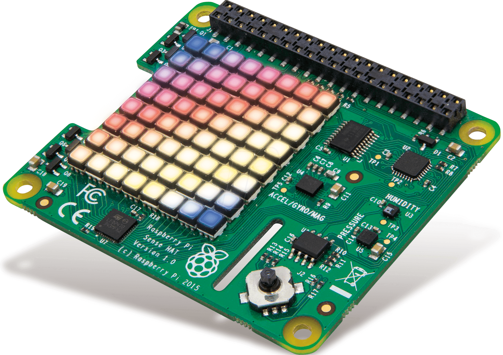
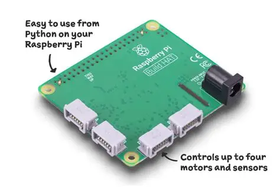

<center><h1>Team Chaos — WRO 2025 Future Engineers</h1></center>


<p align="center">

  
</p>

[](https://github.com/Jackybox123/Team-Chaos-WRO-2025)
[](https://www.youtube.com/@teamchaos)

---

## Table of Contents
* [The Team](#the-team)
* [Project Summary](#project-summary)
* [Executive Summary](#executive-summary)
* [Communication Design](#communication-design)
* [Technical Solution Design](#technical-solution-design)
* [Robot Photos](#robot-photos)
* [Mobility Management](#mobility-management)
* [Power & Sense Management](#power-and-sense-management)
* [Obstacle Management](#obstacle-management)
* [Photos of the Data We Captured](#photos-of-the-data-we-captured)
* [Schematic Diagram of the CNN](#schematic-diagram-of-the-cnn)
* [Code Explanations & Code Blocks](#code-explanations--code-blocks)
* [Car Components and Explanation](#car-components-and-explanation)
* [Component Cost Table](#component-cost-table)
* [Assembly Instructions](#assembly-instructions)
* [Challenges and Solutions](#challenges-and-solutions)
* [Conclusion](#conclusion)

---

## The Team <a name="the-team"></a>

### Team Members

**Kyle Ho:**  
An 9th grader high school student from California, United States. He had participated in WRO in previous seasons. He loves robots and is a very innovative person.  

**Jiapeng Xu:**  
Hello, I am a 11th grader from California United States. In my free time I like to code, swim, and snowboard.  I love to come up with solutions for problems and experiment with robotics and AI. This is my second year competing in WRO.  

**Coach: Fei Guo (Robert Guo):**  
Fei Guo (Robert Guo) provides the technical guidance and leadership required to keep Team Chaos on track. With extensive experience in robotics, he helps us navigate complex challenges, refine our designs, and develop solutions that work in competitive and real-world settings.

---

## Project Summary <a name="project-summary"></a>

Using the method of machine learning, a CNN neural network is built to train and predict the pictures of the competition venue.  
This is our AI Lego Car.

Our project combines semi-artificial intelligence and semi-robotics to create a fully functional AI-powered self-driving robot.

---

## Executive Summary <a name="executive-summary"></a>

The Future Engineers competition is an autonomous driving challenge where the robot must navigate and avoid obstacles on the course. We designed our system using a Raspberry Pi as the core processing unit for AI operations. Running on the Raspberry Pi’s Linux OS, the Python environment integrates seamlessly with TensorFlow, Google’s machine learning framework.

We began by attaching a camera module (lens) to the Raspberry Pi to record video footage of a manually operated vehicle. This footage, along with the associated remote-control input data (steering and throttle), was used to train a Convolutional Neural Network (CNN). The CNN learns patterns between image frames and control inputs. Once trained, the model is used to analyze live camera input and predict throttle and steering values in real time.

These AI-generated control signals are then transmitted to a LEGO-based vehicle, enabling it to drive autonomously without human intervention.

---


## Communication Design <a name="communication-design"></a>

Our design facilitates communication between the remote-control interface and the Raspberry Pi, which in turn communicates seamlessly with the LEGO car.

<p align="center">

  
</p>

Control Logic Design: The control logic involves recording the playing field's images and data through a remote-controlled robot. We designed and trained a neural network using a model of the field. During runs, the neural network accesses the trained behavior model to execute actions reminiscent of human operations. These action commands are sent to the LEGO car, which then performs the designated tasks, such as determining throttle or speed based on the image feedback from the Pi Camera.

---

## Technical Solution Design <a name="technical-solution-design"></a>

### Overall Technical Solution Framework

<p align="center">

  
</p>

Machine learning (ML) encompasses a spectrum of methodologies that empower computers to autonomously discover and refine algorithms. A convolutional neural network (CNN) is a specialized feed-forward neural network that inherently learns and perfects feature engineering through filter optimization, making it particularly effective in AI image recognition and autonomous driving applications.

TensorFlow is a renowned, open-source software library dedicated to machine learning and artificial intelligence, offering a versatile toolkit for developers.

---
## Robot Photos <a name="robot-photos"></a>

Here are multiple views of our AI Lego Car.  

|  |  | 
| :--: | :--: | 
| *Birdeye* | *Back* |
|  |  | 
| *Center* | *Camera* |
|  |  | 
| *Top* | *low* |

---

## Mobility Management <a name="mobility-management"></a>

Our vehicle utilizes a custom-built LEGO car platform, which incorporates a DC motor to control throttle and a servo for steering. The DC motor was chosen for its ability to provide smooth acceleration and consistent speed, while the servo offers precise steering control. Both components are managed by the Build HAT, which interfaces directly with the Raspberry Pi to allow for dynamic control.

**AI-Controlled Mobility:**  
To enable autonomous operation, we integrated a Pi Camera to feed real-time visual data to an AI model. The model predicts the appropriate throttle and steering adjustments based on obstacle detection and navigation requirements. The AI model was trained using data collected from manual control, where the car was driven, and the corresponding throttle and steering values were logged alongside images captured by the Pi Camera.

**Challenges in Mobility Management:**  
One of the challenges faced during development was ensuring the AI model could accurately distinguish between obstacles with similar shapes. We overcame this by incorporating color recognition, which allowed the AI to make more precise decisions. Another challenge was syncing the throttle and steering inputs in real-time during training, especially when switching between AI models for different control tasks.

---

## Power & Sense Management <a name="power-and-sense-management"></a>

<p align="center">

  
</p>

Our technical solution incorporated a dual system approach for managing the power and sensing capabilities of the autonomous vehicle.

**Power Management:**  
The LEGO car is powered by a 7.4V lithium battery. The Raspberry Pi, camera, and additional sensor modules are powered by a 5V 2.5A power bank. The Pi Camera provides visual input for the AI model, while sensors connected via the Sense HAT and Build HAT support obstacle detection and decision-making. These sensors help the AI model predict steering and throttle adjustments for accurate navigation. Power consumption is carefully monitored, and the system’s wiring ensures efficient energy distribution with minimal loss.

---

## Obstacle Management <a name="obstacle-management"></a>

<p align="center">

  
</p>

In our autonomous Lego Car vehicle project, the approach to obstacle management is distinctively different from traditional automated programming. Our technical philosophy has been consistent from the beginning, focusing on a strategy that does not rely on pre-defined rules or flowcharts for navigating around obstacles.

Instead of traditional programming techniques such as using flowcharts, pseudocode, or annotated code, we employ a data-driven approach with our AI. The AI learns to drive the vehicle through actual operation by a human operator. The machine records how the operator drives, noting steering and throttle data, and then this data is used to train a neural network.

During the training phase, initially, the vehicle could not distinguish colours such as red and green but was able to identify and navigate around obstacles. With the accumulation of more data - around 70,000 data points - the vehicle began to discern obstacles. At 90,000 data points, it could differentiate and react to colors, associating red with turning right and green with turning left.

Our primary focus has been on accurately recording the operator's maneuvers and feeding this extensive dataset to the model, allowing it to learn driving habits and patterns - a process known as 'fitting.' There is no traditional strategy or flowchart involved; the vehicle's ability to navigate through the course and manage obstacles is entirely based on continuous training from the data gathered during these driving sessions.

**Key Points:**  
The LEGO car uses a combination of AI-driven image processing and sensor input from the Pi Camera and Sense HAT.  
Real-time visual data is analyzed to determine throttle and steering commands.  
Color-based recognition was added to distinguish between obstacle types when shape recognition alone was insufficient.  
A major challenge was real-time performance; we addressed this by optimizing the recognition algorithm and streamlining throttle/steering prediction.  
The system's ability to adapt to dynamic environments stems from its data-centric learning method, mimicking human decision-making through iterative training.

---


## Photos of the Data We Captured <a name="photos-of-the-data-we-captured"></a>

<p align="center">

  
  
</p>


## Schematic Diagram of the CNN <a name="schematic-diagram-of-the-cnn"></a>

<p align="center">

  
</p>

---

## Code Explanations & Code Blocks <a name="code-explanations--code-blocks"></a>

### GPIO Button Code

```python
# GPIO Pin setup and car start logic
# Your full code here
```
We use the GPIO.BCM mode to reference the pins by their Broadcom numbers. GPIO 25 is set up as an input pin with an internal pull-up resistor, which means it will be "high" (on) unless the button is pressed, which would then bring the signal "low" (off). This setup helps the code to distinguish when the button is pressed. The program runs in a loop, checking the button state every 0.1 seconds. If the button is pressed (GPIO 25 goes low), the car can then start running, making this code crucial for triggering the car's activation. The continuous checking ensures the car responds immediately to the button press.

---

### PiCamera Color Detection

```python
import cv2
import numpy as np
import time
from picamera2 import Picamera2
from libcamera import Transform

# Initialize PiCamera
config_dict = {"size": (160, 120), "format": "BGR888"}
transform = Transform(False, False)
camera = Picamera2()
config = camera.create_preview_configuration(config_dict, transform=transform)
camera.align_configuration(config)
camera.configure(config)
        # try min / max frame rate as 0.1 / 1 ms (it will be slower though)
camera.set_controls({"FrameDurationLimits": (100, 1000)})
camera.start()

        # initialize the frame and the variable used to indicate
        # if the thread should be stopped
frame = None
on = True
image_d = 3

        # get the first frame or timeout

# Allow the camera to warm up
time.sleep(0.5)

# Define color ranges for red and green in HSV color space
lower_red1 = np.array([0, 120, 70])
upper_red2 = np.array([10, 255, 255])
lower_green = np.array([36, 100, 100])
upper_green = np.array([86, 255, 255])
lower_red2 = np.array([170, 50, 50])
upper_red2 = np.array([180, 255, 255])


counter =0
start_time =time.time()

# Capture frames continuously from the PiCamera
while True:
    frame = camera.capture_array("main")
    # Convert the image to HSV color space
    frame = cv2.cvtColor(frame,cv2.COLOR_RGB2BGR)
    image = frame
    hsv_image = cv2.cvtColor(image, cv2.COLOR_BGR2HSV)

    # Create masks for red and green colors
    mask_red1 = cv2.inRange(hsv_image, lower_red1, upper_red2)
    mask_green = cv2.inRange(hsv_image, lower_green, upper_green)
    mask_red2 = cv2.inRange(hsv_image, lower_red2, upper_red2)
    mask_red = cv2.bitwise_or(mask_red1, mask_red2)

    # Count non-zero pixels in each mask to detect the presence of color
    red_count = cv2.countNonZero(mask_red)
    green_count = cv2.countNonZero(mask_green)

    if red_count > green_count and red_count > 1000:  # Threshold to avoid small detections
        print("Red detected")
    elif green_count > red_count and green_count > 1000:
        print("Green detected")
    else:
        print("No red or green detected")

    # Display the frame (optional, can be removed if you don't need the display)
    cv2.imshow("Frame", image)

    # Clear the stream for the next frame
#     raw_capture.truncate(0)

#     counter +=1
#     if (time.time() - start_time) > 1:
#         print(counter)
#         counter = 0
#         start_time = time.time()
  
#     previous_time = current_time
   # Exit loop if 'q' is pressed
    if cv2.waitKey(1) & 0xFF == ord('q'):
        break

# Release the resources
cv2.destroyAllWindows()
camera.close()
```
In this code, we use the PiCamera with the Picamera2 library to continuously capture frames from the camera. The frames are processed to detect specific colors, namely red and green, in the image. We use OpenCV’s cv2 library to convert the captured frames to the HSV (Hue, Saturation, Value) color space, which helps in better detecting color ranges.

The code defines two color ranges for red and one for green. It then creates masks for each color by filtering the HSV image. The number of non-zero pixels in each mask is counted to determine the presence of red or green. If there are more red pixels than green pixels and the red count exceeds a threshold (1000 pixels), it prints "Red detected". Similarly, if green has a higher count, it prints "Green detected". If neither color is detected, it prints "No red or green detected". This code helps the car detect obstacles using the camera. It looks for red and green colors to understand which direction to go on the third round because at the end of the second round it will be able to use this code to know which obstacle its looking at to determine if it will continue towards the third round or it will reverse directions and continue to the third round going in the same direction.

---

### WT901 Yaw Sensor

```python
import smbus2
import time

# I2C address of the WT901 sensor (default is 0x50)
DEVICE_ADDRESS = 0x50
# Gyro Z register
GYRO_Z_REGISTER = 0x39  # Example register for Z-axis gyroscope

# Initialize the I2C bus
bus = smbus2.SMBus(1)

# Variable to store the yaw angle
yaw_angle = 0

# Time tracking for integration
previous_time = time.time()

def read_gyro_z():
    # Read two bytes from the gyro Z register
    data = bus.read_i2c_block_data(DEVICE_ADDRESS, GYRO_Z_REGISTER, 2)
    # Combine the two bytes into a 16-bit value
    gyro_z_raw = data[1] << 8 | data[0]
    
    # Convert the raw gyroscope value to angular velocity in degrees per second
    # (You might need to adjust the scale depending on your gyro's sensitivity)
    if gyro_z_raw > 32767:
        gyro_z_raw -= 65536
    gyro_z = gyro_z_raw / 32768.0 * 2000  # Assuming +/- 2000 dps range, adjust if needed
    return gyro_z


try:
    while True:
        # Read the current gyroscope value (Z-axis)
        gyro_z = read_gyro_z()
        if gyro_z > 0:
            gyro_z = gyro_z * 1.008

        # Get the current time
        current_time = time.time()

        # Calculate time difference (delta t)
        delta_t = current_time - previous_time

        # Update the yaw angle using gyro data (angular velocity * time)
        yaw_angle += gyro_z * delta_t

        # Update previous time for the next iteration
        previous_time = current_time

        # Print the current yaw angle
        print("Yaw Angle: {:.2f} degrees".format(yaw_angle))

        # Wait for a short period before the next reading
        time.sleep(0.1)

except KeyboardInterrupt:
    print("Program interrupted")
```
This code helps our car track how much it’s turning by reading data from a WT901 sensor. The sensor measures the car’s rotation around the Z-axis (yaw), which tells us how the car is facing. It works like this: First, the car uses I2C to talk to the sensor and get data about its Z-axis rotation. The sensor gives us a raw number that represents how fast the car is turning. We convert that number into degrees per second, so we know how much it’s rotating. Then, the code keeps track of how long it’s been since the last time it checked the sensor. It uses that time difference to calculate how much the car’s yaw angle has changed. This way, we can figure out the car’s exact direction by adding up the changes over time. So, when the car is running, the code updates the yaw angle and prints out the car’s direction in real time. This helps the car know where it’s facing this is important as it lets us know when to change between ai models for example we trained models for parking and many other stuff once the car reaches a certain degree or location this lets us use a different ai model to accomplish a different task that is required at that point in time of the run.

---

### Keyboard & Joystick Control

```python

import os
import time
import sys
import serial
import time
import Adafruit_PCA9685
import pygame
import cv2


pygame.init()
screen = pygame.display.set_mode((1,1),pygame.NOFRAME)

"""
init pwm9685
"""
# pwm = Adafruit_PCA9685.PCA9685()
# Alternatively specify a different address and/or bus:
pwm = Adafruit_PCA9685.PCA9685(address=0x40, busnum=1)
# Configure min and max servo pulse lengths
# Helper function to make setting a servo pulse width simpler.
def set_servo_pulse(channel, pulse):
    pulse_length = 1000000    # 1,000,000 us per second
    pulse_length //= 60       # 60 Hz
    print('{0}us per period'.format(pulse_length))
    pulse_length //= 4096     # 12 bits of resolution
    print('{0}us per bit'.format(pulse_length))
    pulse *= 1000
    pulse //= pulse_length
    pwm.set_pwm(channel, 0, pulse)
# Set frequency to 60hz, good for servos.
pwm.set_pwm_freq(60)


default_servo_signal = 350 # 345 is 
default_servo_steering_signal = 350 #350
servo_signal = default_servo_signal
servo_steering_signal = default_servo_steering_signal
run_main= True

# keys = pygame.key.get_pressed()
while run_main:

    pwm.set_pwm(0, 0, servo_signal)
    pwm.set_pwm(1, 0, servo_steering_signal)
    time.sleep(0.05)
    
    
    for event in pygame.event.get():
        if event.type == pygame.KEYDOWN:
            if event.key == pygame.K_q:
                run_main = False
            if event.key == pygame.K_i:
                servo_signal = servo_signal + 2
            if event.key == pygame.K_k:
                servo_signal = servo_signal - 2
            if event.key == pygame.K_j:
                servo_steering_signal = servo_steering_signal + 5
            if event.key == pygame.K_l:
                servo_steering_signal = servo_steering_signal - 5
    print("servo_steering_signal",servo_steering_signal,"servo_signal",servo_signal)


print("break!")
pygame.quit()
servo_signal = default_servo_signal
servo_steering_signal = default_servo_steering_signal
for i in range(0,20):

    
    pwm.set_pwm(0, 0, servo_signal)
    pwm.set_pwm(1, 0, servo_steering_signal)
    print("servo_steering_signal",servo_steering_signal,"servo_signal",servo_signal)
    time.sleep(0.05)
```
This code is used to control the car’s speed and direction using a keyboard. It begins by setting up the signals for controlling the car’s motors. The car starts with a default speed and steering values, both set to 350, which represent the car’s starting movement. You can control how the car moves by pressing certain keys on the keyboard. Pressing the i key increases the car’s speed, while pressing the k key decreases the speed. If you press j, the car will steer left, and pressing L will steer it right. Each time you press one of these keys, the car’s speed or direction will change accordingly.

To stop controlling the car, you can press the q key. This will stop the car’s movement and end the program. After stopping, the car will automatically reset to its default speed and steering position, moving in a neutral state for a short time before the program ends. In summary, this code allows you to control the car’s speed and steering by using the i, k, j, and l keys, and you can stop the car anytime by pressing the q key and this important for us as that lets up to adjust the car by using manual controls from keyboard to drive it around and observe its movements for further adjustments.

This script is designed for us to control a car's movement using a joystick, with the help of the Adafruit PCA9685 module to adjust the car's throttle and steering. First, we set the PWM frequency for the servos at 60Hz, which is standard for servo motors, and initialize the joystick with the Pygame library. After the joystick is connected, the script waits for input. Once data is received from the joystick, it moves forward with setting default values for the throttle and steering signals, which help control the car’s movement. In the main loop, we read the joystick's axis values to control the throttle and steering. The vertical axis (axis4) controls the car’s throttle, and the signal is adjusted between 300 and 400. The horizontal axis (axis0) controls the steering, with the signal adjusted between 220 and 520. These PWM signals are then sent to the PCA9685 module, which controls the servos, allowing us to steer and adjust the throttle in real-time. The script continuously updates the servo positions based on joystick input, giving us full control over the car’s movement this is like 07_Control_RCcar_with_KB.py where the difference is we are controlling the car this time with controller which makes it easier to drive the car and observe the car in at the same time.

---

### Autonomous Car Main Loop

```python

#!/usr/bin/env python3
import os
import sys
import time
import signal
from sense_hat import SenseHat
from buildhat import Motor, ColorSensor
import donkeycar as dk
from donkeycar.parts.keras import KerasInterpreter, KerasLinear
from donkeycar.parts.transform import Lambda
from donkeycar.parts.camera import PiCamera

# ----- CONFIG -----
MODEL_PATH = os.path.expanduser("~/projectbuildhat/obstacleruncwmodels14/mypilot.h5")
CAP_W, CAP_H = 192, 144
CROP_W, CROP_H = 160, 120
MAX_SPEED = 35
DRIVE_LOOP_HZ = 20
ANGLE_OFFSET = 1.2
YAW_LIMIT = 1080
LINE_TARGET = 24
STOP_DELAY = 3.0
GYRO_CAL_SEC = 3.0
GYRO2DEG = 57.2958

# ----- CAMERA -----
def center_crop(img, tw=CROP_W, th=CROP_H):
    h, w = img.shape[:2]
    x0 = (w - tw) // 2
    y0 = (h - th) // 2 + 8
    return img[y0:y0+th, x0:x0+tw]

def add_camera(car):
    cam = PiCamera(image_w=CAP_W, image_h=CAP_H, image_d=3, vflip=False, hflip=False)
    car.add(cam, outputs=["cam/raw"], threaded=True)
    car.add(Lambda(center_crop), inputs=["cam/raw"], outputs=["cam/image_array"])

# ----- GYRO -----
class GyroYaw:
    def __init__(self):
        self.sh = SenseHat()
        self.sh.set_imu_config(True, False, False)
        self.bias = self._calibrate()
        self.yaw = 0.0
        self.last = time.time()

    def _calibrate(self):
        print("GyroYaw: calibrating...")
        total, count = 0, 0
        t0 = time.time()
        while time.time() - t0 < GYRO_CAL_SEC:
            total += self.sh.get_gyroscope_raw()['z']
            count += 1
            time.sleep(0.01)
        return total / count if count else 0

    def run(self):
        now = time.time()
        dt = now - self.last
        self.last = now
        z = self.sh.get_gyroscope_raw()['z'] - self.bias
        self.yaw += z * GYRO2DEG * dt
        return self.yaw

# ----- PARTS -----
class LegoSteering:
    def __init__(self, port="A", left=-50, right=50):
        self.motor = Motor(port)
        self.left, self.right = left, right
        self.prev = None
        self.motor.run_to_position(0)

    def run(self, angle):
        angle *= ANGLE_OFFSET
        angle = max(min(angle, 1), -1)
        pos = int(round((self.left + (angle + 1) * (self.right - self.left) / 2) / 10) * 10)
        if pos != self.prev:
            self.motor.run_to_position(pos, speed=100, wait=False)
            self.prev = pos

    def shutdown(self):
        self.motor.run_to_position(0)
        self.motor.stop()

class LegoThrottle:
    def __init__(self, port_l="B", port_r="C", max_speed=MAX_SPEED):
        self.ml, self.mr = Motor(port_l), Motor(port_r)
        self.max_speed = max_speed
        self.last = 0

    def run(self, throttle):
        speed = int(round(throttle * self.max_speed / 10) * 10)
        if speed != self.last:
            if speed == 0:
                self.ml.stop(); self.mr.stop()
            else:
                self.ml.start(speed=speed)
                self.mr.start(speed=speed)
            self.last = speed

    def shutdown(self):
        self.ml.stop(); self.mr.stop()

class ColorLineCounter:
    def __init__(self):
        self.sensor = ColorSensor("D")
        self.prev = False
        self.count = 0

    def run(self):
        r, g, b, i = self.sensor.get_color_rgbi()
        is_white = (r > 200 and g > 200 and b > 200 and i > 180)
        on_line = not is_white
        if on_line and not self.prev:
            self.count += 1
            print(f"Line detected — Count: {self.count}")
        self.prev = on_line
        return self.count, 0  # return as (orange, blue)

class StopGuard:
    def __init__(self, yaw_limit=YAW_LIMIT, total_needed=LINE_TARGET, delay_sec=STOP_DELAY):
        self.limit = yaw_limit
        self.total = total_needed
        self.delay = delay_sec
        self.time_met = None

    def run(self, throttle, yaw, orange, blue):
        total = orange + blue
        now = time.monotonic()
        if total >= self.total:
            if self.time_met is None:
                self.time_met = now
        else:
            self.time_met = None

        if abs(yaw) > self.limit or (self.time_met and now - self.time_met > self.delay):
            print("Stop condition met.")
            raise KeyboardInterrupt
        return throttle

class ConsoleTelemetry:
    def __init__(self, interval=0.5):
        self.interval = interval
        self.next = time.monotonic()

    def run(self, angle, throttle, yaw, orange, blue):
        now = time.monotonic()
        if now >= self.next:
            print(f"Angle: {angle:+.2f} Throttle: {throttle:+.2f} "
                  f"Yaw: {yaw:+.2f}°  Count: {orange + blue}")
            self.next = now + self.interval

# ----- VEHICLE -----
def build_vehicle():
    car = dk.vehicle.Vehicle()
    add_camera(car)

    # Pilot
    interp = KerasInterpreter()
    pilot = KerasLinear(interpreter=interp, input_shape=(CROP_H, CROP_W, 3))
    pilot.load(MODEL_PATH)
    car.add(pilot, inputs=["cam/image_array"], outputs=["angle", "throttle"])

    # Gyro
    gyro = GyroYaw()
    car.add(gyro, outputs=["yaw"])

    # Line counter
    counter = ColorLineCounter()
    car.add(counter, outputs=["orange", "blue"])

    # Guard
    guard = StopGuard()
    car.add(guard, inputs=["throttle", "yaw", "orange", "blue"], outputs=["safe_throttle"])

    # Telemetry
    car.add(ConsoleTelemetry(), inputs=["angle", "safe_throttle", "yaw", "orange", "blue"])

    # Actuators
    car.add(LegoSteering(), inputs=["angle"])
    car.add(LegoThrottle(), inputs=["safe_throttle"])

    return car

# ----- MAIN -----
def shutdown(_sig=None, _frame=None):
    print("Shutting down...")
    try:
        vehicle.shutdown()
    except:
        pass
    sys.exit(0)

signal.signal(signal.SIGTERM, shutdown)
signal.signal(signal.SIGINT, shutdown)

vehicle = build_vehicle()

try:
    vehicle.start(rate_hz=DRIVE_LOOP_HZ)
except KeyboardInterrupt:
    print("KeyboardInterrupt received.")
finally:
    shutdown()

```
The Python code is designed to control an Lego car autonomously using machine learning, camera input, and sensor data. It utilizes a Raspberry Pi camera to capture images, which are then processed by a pre-trained AI model to predict the car’s steering and throttle control. This allows the car to navigate without human intervention. The car’s rotation is monitored using a gyroscope, which measures its yaw angle. The system tracks the car’s rotation through the Z-axis data from the gyroscope, and the car stops after completing three full rotations (1080 degrees). This ensures the car follows a precise path and halts at the correct time. The movement of the car is controlled by adjusting PWM signals, which are sent to a motor driver to control the motor’s speed and direction based on the AI model's predictions. The car only starts moving once it receives a signal from the GPIO input, ensuring everything is set up before it begins operation. Real-time feedback is displayed on an LCD screen, showing useful information such as the yaw angle and the AI model’s status. This allows the car's performance to be monitored continuously. The car also includes a basic color detection feature, which can identify specific colors, though it is not fully integrated in the current version of the code. In the main loop, sensor data is gathered, images are captured, predictions are made by the AI model, and the car’s movement is controlled. Once the three rotations are completed, the car stops as planned. Finally, the code includes a shutdown process to safely power down the system, ensuring that everything, including the camera, is properly turned off after the task is complete.

This code enables our robot to navigate the obstacle run, detect signals, and park autonomously. It uses a camera and a machine-learning model to process what the robot sees, helping it decides how to steer and move forward. A gyroscope tracks the robot's orientation, ensuring it completes three full laps before stopping. The code also allows the robot to detect red signals, which trigger a U-turn, enabling it to adapt dynamically to the course. The robot's motors and steering are controlled by PWM signals for smooth and precise movement, with a GPIO pin used to start or stop its actions. Its status, like running or waiting, is displayed on an LCD screen. At the end of the obstacle course, the code switches the robot to parking mode, where a specific AI model guides it into a parking space. This makes the robot fully autonomous and ready for robotics competitions.


---

## Car Components and Explanation <a name="car-components-and-explanation"></a>

### LEGO Motor

<p align="center">
  <!-- Replace with your actual LEGO motor image -->
  
</p>

The LEGO motor is a critical part of our robot, responsible for controlling the car’s movement and driving. In our design, the LEGO motor was chosen as an improvement over motors used in previous seasons. We found that the LEGO motor provides smoother acceleration, consistent speed, and precise control, making it easy to integrate with our Build HAT and Raspberry Pi system. The simplicity and reliability of the LEGO motor allowed us to focus on developing the AI and navigation systems, confident that the mechanical aspect of movement would be handled effectively. Its compatibility with LEGO Technic elements also meant we could easily adjust or expand our drivetrain as needed during testing and competition.

---

### VL53L0X ToF (Time-of-Flight) Sensor

<p align="center">
  <!-- Replace with your actual VL53L0X sensor image -->
  
</p>

The VL53L0X ToF sensor is an essential upgrade in our car’s sensing suite, especially for parking and wall detection. As a laser-based distance sensor, it provides millimeter-accurate measurements of the distance between the car and nearby objects. This sensor plays a crucial role in our parking control system, enabling the robot to detect walls and avoid contact with barriers. By continuously measuring the distance to obstacles in real-time, the VL53L0X allows our car to stop at the perfect position when parking, and to navigate tight spaces with confidence. Its fast response and precise readings have made it the ideal solution for obstacle avoidance and parking maneuvers, boosting our robot’s performance and reliability compared to previous approaches.


### Raspberry Pi Description



The Raspberry Pi is a compact, affordable computer designed for learning, prototyping, and experimentation. Despite being about the size of a credit card, it functions as a full-fledged computer capable of running complex programs, handling input/output operations, and interfacing with a wide variety of devices. Due to its versatility, portability, and low cost, it is widely used in electronics projects, programming, and robotics.

**Raspberry Pi in Our LEGO Car:**  
In our LEGO car system, the Raspberry Pi plays a central role by handling all core operations required for autonomous driving. It processes the video feed from the Pi Camera, enabling the car to interpret its environment, and runs the AI model responsible for making real-time decisions regarding steering and speed.

Its small form factor and low power consumption allow it to integrate seamlessly into the LEGO structure without compromising space or performance. Additionally, the Raspberry Pi’s compatibility with modules like the Sense HAT and Build HAT makes it ideal for connecting to sensors and motors in a LEGO-based system. Without the Raspberry Pi, the vehicle would not be able to process environmental data or respond to dynamic conditions, making it a vital component for the success of our autonomous LEGO car.

### Pi Camera Description

<p align="center">

  
</p>

The Raspberry Pi Camera is a compact, high-definition camera module designed specifically for use with Raspberry Pi boards. It connects via the CSI (Camera Serial Interface) port and is capable of capturing high-resolution still images and video. The Pi Camera is widely used in DIY electronics, robotics, and computer vision applications due to its small size, flexibility, and support for various image processing modes. It integrates effectively with machine learning models for tasks such as object detection, tracking, and real-time video analysis.

**Pi Camera in Our LEGO Car:**  
In our LEGO car system, the Pi Camera serves as the "eyes" of the self-driving robot, delivering essential visual input to the AI model. During initial training sessions, the camera captures images of the environment, track layout, and surrounding obstacles. These images are then used to train a machine learning model using TensorFlow, enabling the system to identify patterns and make informed driving decisions.

Once the AI model is trained, the Pi Camera continues to play a vital role during autonomous operation by providing real-time visual data. This live feed is processed by the AI to determine appropriate throttle and steering commands. As such, the Pi Camera is crucial to both the training and real-time navigation phases, making it one of the key components of our LEGO-based autonomous driving platform.

### Sense HAT Description



The Sense HAT is an add-on board for the Raspberry Pi that provides a suite of sensors and a programmable LED matrix. It includes sensors for temperature, humidity, barometric pressure, and orientation (via gyroscope, accelerometer, and magnetometer). Originally developed for educational and space-related projects, it allows real-time environmental data collection and interactive feedback.

**Sense HAT in Our LEGO Car:**  
In our LEGO car, the Sense HAT is used primarily for motion sensing and directional feedback. By reading values from its onboard gyroscope and accelerometer, we are able to monitor the car’s orientation and rotational changes during movement. This data helps the AI determine when the car has completed certain maneuvers, such as turns or laps, and allows us to switch AI models or driving modes at the right moments. The compact design of the Sense HAT, combined with its direct compatibility with the Raspberry Pi, makes it a convenient and powerful tool for integrating real-time feedback into our autonomous vehicle.

### Build HAT Description



The Build HAT (Hardware Attached on Top) is a LEGO-compatible motor and sensor controller developed by Raspberry Pi. It allows up to four LEGO Technic motors or sensors to be controlled directly from a Raspberry Pi using the standard LPF2 connectors. The Build HAT simplifies control of LEGO elements by handling the communication and power management needed to operate motors with precision.

**Build HAT in Our LEGO Car:**  
In our LEGO car, the Build HAT is used to control the car’s movement by managing the LEGO motors responsible for throttle and steering. It interfaces seamlessly with the Raspberry Pi and enables precise motor control through Python code. The Build HAT eliminates the need for third-party servo controllers or custom circuits, providing a clean and reliable solution for motor management. Its native support for LEGO components makes it an essential bridge between our AI control system and the physical LEGO hardware, ensuring smooth and responsive driving behavior during autonomous runs.

---

## Component Cost Table <a name="component-cost-table"></a>

Below is a chart of estimated costs for each major component, with purchase links (Amazon or manufacturer):

| Component                  | Quantity | Estimated Price (USD) | Purchase Link |
|----------------------------|----------|-----------------------|--------------|
| Raspberry Pi 4             | 1        | $50                   | [Amazon](https://www.amazon.com/dp/B07TD42S27) |
| Pi Camera v2               | 1        | $25                   | [Amazon](https://www.amazon.com/dp/B01ER2SKFS) |
| Sense HAT                  | 1        | $40                   | [Amazon](https://www.amazon.com/dp/B01EGB0H7O) |
| Build HAT                  | 1        | $35                   | [Pi Shop](https://www.raspberrypi.com/products/build-hat/) |
| LEGO DC Motor              | 2        | $45                   | [LEGO Shop](https://www.lego.com/en-us/product/m-motor-8883) |
| LEGO Servo                 | 2        | $40                   | [LEGO Shop](https://www.lego.com/en-us/product/servo-motor-88004) |
| 7.4V LiPo Battery          | 1        | $18                   | [Amazon](https://www.amazon.com/dp/B07KZ8YQJH) |
| Power Bank (5V/2.5A)       | 1        | $20                   | [Amazon](https://www.amazon.com/dp/B07QK2SPP7) |
| LEGO Chassis Parts         | -        | $50                   | [LEGO Shop](https://www.lego.com/en-us/themes/technic) |
| VL53L0X ToF (Time-of-Flight) Sensor   | -        | $10        | [Amazon](https://www.amazon.com/dp/B07GD2BWPY) |
| Miscellaneous Wires        | -        | $10                   | [Amazon](https://www.amazon.com/dp/B07GD2BWPY) |


**Total Estimated Cost:** ~$343


---

## Assembly Instructions <a name="assembly-instructions"></a>

<p align="center">

  
</p>


The assembly process for the Team Chaos self-driving car focuses on combining mechanical strength, electrical stability, and AI decision-making into a small and modular design. The car’s frame is mainly built from LEGO Technic pieces, which provide both durability and flexibility for fast adjustments during testing. At the center of the system is the Raspberry Pi 4 Model B, which acts as the main control unit. It connects directly to the LEGO Build HAT, allowing easy motor and sensor control through Python and keeping the wiring organized and light.

The build begins by creating a rectangular chassis using LEGO Technic beams and connectors. This structure forms the base that supports the motors, sensors, and control modules. Two large LEGO motors are installed on the rear axle and connected to the Build HAT’s ports A and B. These motors power the car’s movement. A differential gear is added between the rear wheels to keep the car stable during turns, helping it distribute torque smoothly. The front of the car holds a medium motor connected to the steering system. This motor, attached to port C, lets the car turn left and right precisely according to the AI’s steering commands.

The Raspberry Pi is mounted on top of the chassis using a flat LEGO or 3D-printed mounting plate, leaving enough space underneath for cable management and airflow. The Build HAT fits neatly on top of the Pi’s GPIO pins, keeping everything compact. To prevent overheating during long runs, a small fan and heatsink are attached to the Pi’s CPU and powered from the 5V GPIO pins.

At the front, the Raspberry Pi Camera Module is mounted using a LEGO bracket that angles slightly downward. This helps the camera capture both the track and upcoming obstacles. The CSI ribbon cable is carefully routed to avoid getting caught in the steering system. When calibrating, the camera’s angle is adjusted so that the AI model consistently recognizes lanes and pillars.

Under the chassis, a LEGO color sensor is installed between the front wheels, facing downward. It detects colored strips on the ground, identifying transitions between white and colored surfaces like blue or orange. Each time a strip is detected, the robot updates counters displayed on the Sense HAT LED matrix. The color sensor connects to the Build HAT’s port D.

Behind the Raspberry Pi, the Sense HAT is placed on a small LEGO platform with its LED display facing upward. It shows the live count of orange and blue strips, as well as indicators of the car’s current mode. For example, it lights up green while moving forward, yellow during turns, and red when the car stops after completing its 24-strip goal.

The power system uses two separate sources: a 9V LEGO battery box for the Build HAT and a USB power bank for the Raspberry Pi. This separation avoids interference between motor power and logic circuits. All wires are secured with clips along the side of the chassis so nothing blocks the wheels or sensors.

Once the hardware is ready, software setup begins. The Raspberry Pi runs on Raspberry Pi OS, with the libraries buildhat, opencv-python, tensorflow, and sense_hat installed. The CNN model, trained with image data from different lighting and track conditions, is stored in the /models folder. The main program initializes the camera feed, predicts steering and speed, and sends motor commands through the Build HAT interface.

Before any autonomous runs, calibration steps are performed to ensure accuracy:

Camera Calibration: The car is placed on the track while OpenCV adjusts brightness and contrast for clear detection of color strips and obstacles.
Color Sensor Calibration: The sensor reads RGBI values for white, blue, and orange to define reliable detection thresholds.
Steering Alignment: The steering motor is centered so that the wheels start from a neutral position.
Debounce Testing: The color detection code is tested to make sure each strip is counted once, avoiding false readings.

After calibration, the car goes through test runs. It first drives in manual mode to confirm motor and steering performance. Then, in AI mode, the car navigates the track autonomously. The Raspberry Pi camera detects red and green pillars, which the system uses to decide whether to turn left or right. Throughout the run, the Sense HAT provides live feedback on color counts and system status.

The assembly and setup are designed to be modular and safe, allowing quick replacements or upgrades for each part—camera, sensors, motors, or AI controller. The layout keeps the car balanced and reduces vibration, which helps the AI model perform more accurately. In the end, the Team Chaos self-driving car stands as a durable, flexible, and intelligent platform for robotics learning and competition, built from accessible components and careful engineering.
---

## Challenges and Solutions <a name="challenges-and-solutions"></a>

Throughout the development of this project, we encountered a series of challenges. First, there was the issue of image resolution. When using larger image sizes, the processing demands increased significantly, causing training sessions to last over 8 hours. To resolve this, we downscaled the input data and selected a resolution of 160 by 120 pixels to optimize training efficiency.

Next, we faced difficulties with overly lengthy road models. To make training more effective, we segmented portions of the data model and trained them in smaller batches. Lastly, we ran into software compatibility issues. For example, models trained using TensorFlow 2.9 were not compatible with older versions like TensorFlow 2.4. To address this, we standardized all systems to run TensorFlow 2.9 for consistency and improved integration.

---

## Conclusion <a name="conclusion"></a>

Our team has employed a unique approach in the design of our intelligent vehicle, which is characterized using a purely Artificial Intelligence (AI)-driven model. At the heart of this system is a Convolutional Neural Network (CNN) running in a Linux environment, built using Google’s TensorFlow framework. The CNN is designed to learn and replicate the driving habits of a human operator by analyzing images captured by the camera and movement data from the remote control. This allows the AI model to self-train and adapt based on real-world input.

In practice, the neural network processes visual data from the course and makes predictions about optimal movements. These decisions are then communicated to the vehicle’s control system — in our case, the LEGO car.

Our design philosophy has been consistent from the start: to integrate the strengths of traditional programming with modern AI. By feeding the AI a large volume of real driving data, it can make intelligent predictions while also learning the operator’s behavior, resulting in a more human-like and adaptable driving system. The vehicle is not just mechanically responsive; it is guided by an intelligent system that blends precision control with learned behavior for a more sophisticated autonomous experience.

---
